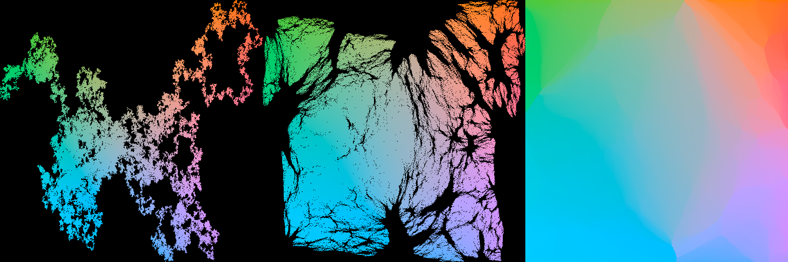

# megalap

`megalap` is a Python package with a native C++ core and `nanobind` bindings for point-to-grid assignment work.

The public API is intentionally small:

1. `linear_sum_assignment(cost_matrix)`
2. `window_cleanup(points, initial_assignment, rows, cols, budget_seconds, ...)`
3. `snap_to_grid(points, width=None, height=None, cleanup_seconds=None, ...)`

## Showcase

`512x512` meandering point cloud, recursive `8x8` seed, `30s` of native `6x6` cleanup, rendered as a three-panel hero image on a black background:

1. the initial point cloud
2. a `50%` interpolated view
3. the final grid

All three panels use the same Lab-derived coloring with source `x/y` mapped into `a/b`.



## Install

From PyPI:

```bash
python -m pip install megalap
```

From a local checkout:

```bash
python -m pip install -e .
```

## API

### `linear_sum_assignment(cost_matrix)`

Solve a dense square LAP with the native C++ Jonker-Volgenant implementation.

Inputs:

- `cost_matrix`: `float64` array-like of shape `(n, n)`

Returns:

- `row_ind`: `int64` NumPy array of shape `(n,)`
- `col_ind`: `int64` NumPy array of shape `(n,)`
- `total_cost`: Python `float`

### `window_cleanup(points, initial_assignment, rows, cols, budget_seconds, window_size=6, margin=0.03, num_threads=None, fixed_suffix_count=0)`

Run the native overlapping-window cleanup kernel.

Behavior:

- uses the C++ backend
- solves each phase as multiple independent small JV problems
- runs same-phase window solves in parallel with native C++ threads
- `num_threads=None` uses `std::thread::hardware_concurrency()`
- `num_threads=1` forces serial cleanup
- `fixed_suffix_count` can keep a suffix of target cells locked, which is useful for padded ghost points

Inputs:

- `points`: `float64` array-like of shape `(n, 2)`
- `initial_assignment`: `int64` array-like of shape `(n,)`
- `rows`, `cols`: target grid dimensions
- `budget_seconds`: cleanup wall-clock budget
- `window_size`: default `6`
- `margin`: normalized grid margin
- `num_threads`: optional thread count override
- `fixed_suffix_count`: number of trailing target cells to keep fixed during cleanup

Returns a Python `dict` with:

- `assignment`: final `int64` NumPy array
- `passes_completed`
- `elapsed_s`
- `final_cost`

### `snap_to_grid(points, width=None, height=None, cleanup_seconds=None, window_size=6, margin=0.03, num_threads=None, exact_point_limit=10000)`

High-level point-cloud wrapper.

Behavior:

- chooses a destination grid automatically when `width` and `height` are omitted
- prefers exact rectangular sizes with aspect ratio in `[1:1, 2:1]`
- if no exact factorization exists in that range, chooses a near-square enclosing grid in that same band
- pads with edge ghost points when the grid has more cells than real points
- when the padded assignment problem has fewer than `10000` cells, runs the native auction LAP solver by default
- when the padded assignment problem has `10000` cells or more, skips dense exact assignment and runs the native iterative cleanup solver for `10s` by default
- pass `cleanup_seconds` to override the default iterative budget; `cleanup_seconds=0.0` disables cleanup
- passes `num_threads` through to the native cleanup kernel
- pass `exact_point_limit` to adjust the automatic exact/iterative threshold

Returns three values:

- `grid_points`: `(n, 2)` float64 NumPy array of assigned destination-grid positions, in the original source-point order
- `assignment`: `(n,)` int64 NumPy array of destination-grid indices for the original source points
- `(width, height)`: destination-grid size tuple

## Example

See [examples/basic_usage.py](examples/basic_usage.py).

Run it after installation:

```bash
python -m pip install -e '.[examples]'
python examples/basic_usage.py
```

The showcase image above was generated with:

```bash
python examples/render_showcase.py \
  --grid-width 512 \
  --grid-height 512 \
  --image-width 512 \
  --image-height 512 \
  --cleanup-seconds 30 \
  --output assets/showcase_triptych_512.png
```

That renderer uses NumPy directly and writes the PNG without matplotlib.

For release instructions, see [PUBLISHING.md](PUBLISHING.md).

## Cleanup Threading Benchmark

There is a small reproducible threading benchmark at [examples/benchmark_threads.py](examples/benchmark_threads.py).

Run it with:

```bash
python examples/benchmark_threads.py
```

On this machine (`16` logical CPUs), using a `256x256` meandering point cloud, identity seed assignment, `window_size=6`, and a `1.0s` cleanup budget, the median of `3` runs was:

| mode | median elapsed | median passes | median passes/s |
|---|---:|---:|---:|
| `num_threads=1` | `1.028 s` | `3` | `2.92` |
| `num_threads=None` | `1.026 s` | `31` | `30.20` |

So the default threaded path improved cleanup throughput by about `10.3x` on that benchmark.

## Notes

- `linear_sum_assignment()` currently expects a square cost matrix.
- `snap_to_grid()` handles non-rectangular point counts by padding with visible ghost points along the trailing edge of the chosen destination grid.
- `snap_to_grid()` uses the padded grid size, not just the number of input points, when deciding whether the default path should be exact or iterative.
- The cleanup kernel uses overlapping windows of at most `6x6`, so the native small-JV kernel is specialized for up to `36` points per window.
- The native cleanup kernel uses standard C++ threads and does not depend on OpenMP.
- GitHub Actions builds release artifacts for Linux, macOS, and Windows wheels, plus an sdist.
